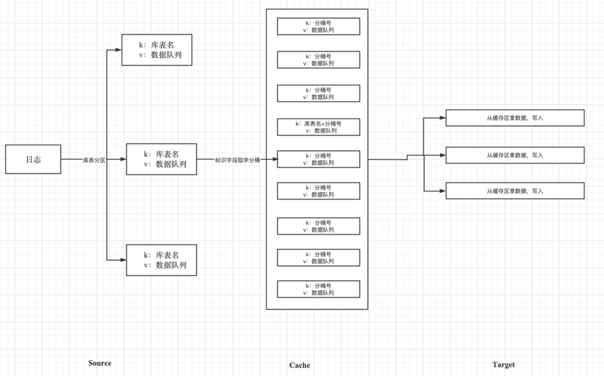

<div align="center">


[官方网站](https://whaleal.com/)  |  [版本发布](https://github.com/whaleal/DocumentDataTransfer/releases)  |  [获取演示demo](https://docs.whaleal.com/guide/zh-hans/documentDataTransfer/)

</div>

<p></p>
<p></p>
<p></p>
<p></p>

---

****商业版新发布release 1.0.0 的版本，说明如下：****

1、【同步功能】支持全量、实时、全量加增量、全量加实时同步。

2、【校验功能】支持精确count、hash、范围、全部数据校验。

---

# 一、概述

## 1.1、行业背景

由于目前MongoDB副本集内置的主从同步对于这种业务场景有较大的局限性，为此，我们开发了DDT同步工具，可以应用在实例，机房、跨数据中心复制，满足灾备和多活需求。

传统MongoDB数据同步仅支持相同架构的数据同步，DDT支持单节点，复制集，分片三种类型架构的数据相互传输。帮助用户实现类似于复制集点到分片 分片到单节点的数据同步方案

DDT的核心实时同步：我们利用对OPLOG日志的解析和应用，高效安全的实现实时同步。

源端MongoDB可以是单实例、副本集或分片，而目标可以是 mongod 或 mongos。如果源端是副本集，我们建议从次要/隐藏节点中获取数据以减轻主节点压力。如果源端是分片，每个分片都应该连接到 DDT。
## 1.2、DDT简介

DDT是由上海锦木信息技术有限公司(以下简称“锦木信息”)结合众多客户需求和锦木信息多年 MongoDB 一线服务及研发经验所推出新一代MongoDB数据库迁移同步工具。

DDT是一个以JAVA语言开发的通用的传输软件，具有高健壮性、高传输性、高可用性的特点，可以快速稳定的迁移数据，帮助用户进行实现数据备份，实时迁移，备份容灾等业务操作。用户也可自定义配置参数来实现场景不同高效传输。

# 二、产品功能

**全量同步流程图**


**实时同步流程图**
 

<table>
  <tr>
    <th>功能模块</th>
    <th>功能项</th>
    <th>描述</th>
  </tr>
  <tr>
    <td rowspan="4">同步模式</td>
    <td>全量同步</td>
    <td>全量同步表，仅同步程序启动前的源表数据</td>
  </tr>
  <tr>
    <td>实时同步</td>
    <td>实时同步源端产生的oplog</td>
  </tr>
  <tr>
    <td>全量和增量同步</td>
    <td>全量同步后，仅同步同步期间对源表进行的操作。实时同步的开始时间为全量同步的开始时间，实时同步的结束时间为全量同步的结束时间</td>
  </tr>
  <tr>
    <td>全量和实时同步</td>
    <td>全量同步后，开始进行实时同步。实时同步的开始时间为全量同步的开始时间</td>
  </tr>
  <tr>
    <td rowspan="6">附加特性</td>
    <td>延迟同步</td>
    <td>在实时同步期间可以延迟设置读取oplog</td>
  </tr>
  <tr>
    <td>同步DDL</td>
    <td>在实时同步期间，用户可以自定义同步某些DDL操作</td>
  </tr>
  <tr>
    <td>源表索引</td>
    <td>在全量同步期间，用户可以设置是否在总数据同步60%以后，开始同步源表的索引列表</td>
  </tr>
  <tr>
    <td>多表并行</td>
    <td>在全量同步时，设置多源表同时同步还是单表依次同步</td>
  </tr>
  <tr>
    <td>同步源表名单</td>
    <td>使用正则表达式设置需要的同步表名单</td>
  </tr>
  <tr>
    <td>时间区间实时同步</td>
    <td>实时同步时，可以设置同步某时间区间内的oplog</td>
  </tr>
  <tr>
    <td >MongoDB版本</td>
    <td>支持版本</td>
    <td>DDT支持3.2，3.4，3.6，4.0，4.4，5.0，6.0版本的</td>
  </tr>
</table>


DDT的优势：

1. **多种同步方案**，DDT支持全量数据复制、实时数据同步、增量数据同步、自定义同步范围、复合数据同步方案；

2. **高速同步机制**，100%传输带宽利用、可控CPU及内存使用、支持多表并传；

3. **小巧稳定**，体积小巧、断点续传、支持多版本MongoDB同步；

4. **高效数据校验**，同步后可校验数据数量、内容、索引、结构等一致性。

# 三、项目介绍

### 3.1、项目结构


后端项目结构如下：

```

├── DocumentDataTransfer-common                  --公共依赖
├── DocumentDataTransfer-execute                 --DDT执行器
├── DocumentDataTransfer-full                    --全量同步
    |—— full-common                              --全量同步公共依赖   
    |—— full-reactive                            --reactive全量同步
    └── full-sync                                --sync全量同步
├── DocumentDataTransfer-realtime                --实时同步
    |—— realtime-common                          --实时同步公共依赖      
    |—— realtime-sync-changestream               --sync-changestream实时同步
    └── realtime-sync-oplog                      --sync-oplog实时同步    
├── DocumentDataTransfer-mongodb-drive           --封装的MongoDB驱动，内涵sync与reactive
├── DocumentDataTransfer-test                    --测试模块
├── DocumentDataTransfer-docs                    --DDT相关介绍
├── DocumentDataTransfer-DDT                     --封装一键启动
└── pom.xml                                      --公共依赖
```


### 3.2、技术框架

- 日志管理：SLF4J 2.16
- 项目管理框架: Maven 3.6.3


### 3.3、开发环境

- IDE: IntelliJ IDEA 2019.2+
- JDK: JDK 1.8
- Maven: Maven 3.6.3


## 3.4、部署流程

[环境要求](https://docs.whaleal.com/guide/zh-hans/documentDataTransfer/Install/Requirements.html)

[安装部署](https://docs.whaleal.com/guide/zh-hans/documentDataTransfer/Install/Installation.html)

[快速启动](https://docs.whaleal.com/guide/zh-hans/documentDataTransfer/Install/QuickStart.html)

[配置说明](https://docs.whaleal.com/guide/zh-hans/documentDataTransfer/Install/Configuring.html)

[使用案例](https://docs.whaleal.com/guide/zh-hans/documentDataTransfer/Usecase/FunctionalTest.html)

## 3.5、定制开发

需要基于DDT做定制业务需求，请联系Whaleal团队。

如果需要技术咨询支持请附上你的微信号，我们会联系您并提供项目和安装的相关技术咨询支持。


# 四、开源说明

**开源不代表免费**

DDT的源码100%开源，遵守GPL-3.0协议。提供开发者学习和交流。

**绝不允许修改后和衍生的代码做为闭源的商业软件发布和销售！**

如果需要将本产品在本地进行任何附带商业化性质行为使用，**请联系项目负责人进行商业授权**。

# 五、💪支持Whaleal

开源不易，坚持更难！如果您觉得DDT不错，可以联系我们团队在此表示感谢^_^。


# 六、联系方式


[comment]: <> (当前我们接受来自于**微信**、**支付宝**的捐赠，请在捐赠时备注自己的昵称或附言。)

[comment]: <> (您的捐赠将用于支付该项目的一些费用支出，并激励开发者们以便更好的推动项目的发展。)

[comment]: <> (<div align=center></div>)
